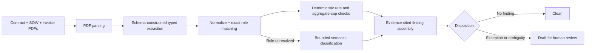

# InvoiceGuardian

[](https://github.com/sammy11111/InvoiceGuardian/actions/workflows/ci.yml)

InvoiceGuardian is an evidence-cited review system for service invoices. It compares an invoice with its governing contract and Statement of Work, separates deterministic controls from bounded model tasks, and produces draft exception findings for human approval.

**[Open the live demo](https://web-production-8e619.up.railway.app)** · [Evaluation rubric](SCORING.md) · [Limitations](LIMITATIONS.md) · [Roadmap](ROADMAP.md)

The demo uses six persisted synthetic scenarios. It does not send documents to a model or run inference when a visitor clicks through the interface.

## What this project demonstrates

- **Applied AI architecture:** schema-constrained extraction and narrowly scoped semantic classification, with arithmetic and policy checks kept in ordinary Python.
- **Evidence-first outputs:** each finding carries source quotes and references instead of an unsupported conclusion.
- **Human control:** every finding is a draft; ambiguous scope is escalated rather than resolved automatically.
- **Evaluation engineering:** the scenario specification, answer keys, and scoring rules were committed before implementation, and a deterministic evaluator enforces hard gates.
- **Full-stack delivery:** Python 3.12, FastAPI, Pydantic v2, Next.js, TypeScript, Tailwind CSS, a deployed demo, and reproducible synthetic data generation.
- **Quality controls:** 137 collected Python tests plus 12 frontend tests, with Ruff, Pyright, ESLint, and production builds enforced in CI.

## System at a glance



| Deterministic Python | Model-assisted | Human decision |
| --- | --- | --- |
| PDF parsing, normalization, exact role matching, rate comparison, aggregate-cap arithmetic, evidence validation, and evaluation | Typed contract/SOW/invoice extraction and semantic classification only after exact role matching fails | Approve, reject, or investigate every draft finding; no payment action is automated |

Every model call uses schema-constrained tool output rather than free text. The evaluator never calls a model: it scores an already-produced pipeline result against [`answer_keys.json`](answer_keys.json) using deterministic comparisons.

## Explore the demo

The deployed interface serves six precomputed runs from [`data/scenario_runs/`](data/scenario_runs/) and their UI projections from [`data/scenario_views/`](data/scenario_views/). The set includes planted rate, authorization, and aggregate-cap exceptions; clean invoices; and one mandatory escalation case.

No API key is required to explore the demo. The same app also exposes:

- `GET /health`
- `GET /api/scenarios`
- `GET /api/scenarios/{invoice_id}`

## Evaluation integrity

### Evaluation before implementation

Commit [`28dad57`](https://github.com/sammy11111/InvoiceGuardian/commit/28dad57d9c8e22ff5973b7d227cf7ebd5e4d303e) added [`scenario-spec.md`](scenario-spec.md), [`answer_keys.json`](answer_keys.json), and [`SCORING.md`](SCORING.md) with no implementation code. The evaluator was added in commit [`7849045`](https://github.com/sammy11111/InvoiceGuardian/commit/78490453f8579b1791b23a2b723178e816ea806e), 3 hours and 49 minutes later. The grading rules therefore existed before the system they grade.

### Deterministic grading

[`src/invoiceguardian/evaluation/evaluator.py`](src/invoiceguardian/evaluation/evaluator.py) contains no model client, model name, or API-key dependency. It applies plain comparisons and hard gates to already-produced results. The test suite covers schemas, deterministic checks, grounding, scoring, failure gates, synthetic data generation, API behavior, retry policy, and pipeline integration.

```bash
uv run pytest --collect-only -q
# 137 tests collected
```

### A documented model failure

[`SCORING.md`](SCORING.md) commits in advance to analyzing at least one genuine failure. Scenario S4 is that failure: an intentionally ambiguous invoice line should be classified as `AMBIGUOUS` and escalated, but the frozen classifier instead returns a confident match.

The behavior is not hidden or patched around. [`test_s4_confident_exception_fails_gate_3`](tests/test_evaluation_gates.py) asserts that a confident result is scored as `incorrect_confident` and fails hard gate 3. Publishing the miss shows that the evaluation harness can detect and retain an unfavorable result.

## Run locally

Requires Python 3.12 and [uv](https://docs.astral.sh/uv/).

```bash
uv sync --frozen
uv run ruff check .
uv run pyright
uv run pytest
```

Serve the API and committed static frontend at `http://localhost:8000`:

```bash
uv run uvicorn invoiceguardian.api.app:app --reload
```

Model-backed extraction and semantic comparison require an Anthropic API key in a repository-root `.env` file:

```dotenv
ANTHROPIC_API_KEY=your-key-here
```

Run one invoice or regenerate all persisted scenarios:

```bash
uv run python -m invoiceguardian.analyze INV-2026-061
uv run python -m invoiceguardian.analyze --all --persist
```

For frontend development:

```bash
cd frontend
npm ci
npm run dev
```

## Repository map

| Area | Purpose |
| --- | --- |
| [`src/invoiceguardian/extraction/`](src/invoiceguardian/extraction/) | Schema-constrained document extraction, normalization, retry handling, and prompts |
| [`src/invoiceguardian/checks/`](src/invoiceguardian/checks/) | Exact role matching, deterministic rate/cap checks, and bounded semantic assembly |
| [`src/invoiceguardian/evaluation/`](src/invoiceguardian/evaluation/) | Deterministic matching, grounding, metrics, and hard gates |
| [`src/invoiceguardian/api/`](src/invoiceguardian/api/) | FastAPI endpoints, public-demo middleware, and UI projections |
| [`frontend/`](frontend/) | Next.js/TypeScript review interface, exported as a static deployment artifact |
| [`tests/`](tests/) | Backend, pipeline, evaluator, and API verification |
| [`scenario-spec.md`](scenario-spec.md) + [`answer_keys.json`](answer_keys.json) | Frozen synthetic scenarios and expected outcomes |

## Scope and limitations

- All documents are synthetic; this benchmark does not estimate accuracy across arbitrary real-world contracts.
- Inputs are digitally generated English-language PDFs. OCR, scanned documents, and arbitrary uploads are out of scope.
- Shipped deterministic checks cover rate mismatches and aggregate monthly caps. Invoice-total arithmetic, date-validity checks, and SOW-reference validation are documented extension work.
- The system does not decide whether to pay, determine whether services were delivered, or provide legal or accounting advice.
- The current deployment is a single-user demonstration with persisted flat-file scenarios, not a production accounts system.

See [`LIMITATIONS.md`](LIMITATIONS.md) for the complete boundary statement and [`ROADMAP.md`](ROADMAP.md) for the path to broader synthetic coverage and professionally labeled real-world validation.
